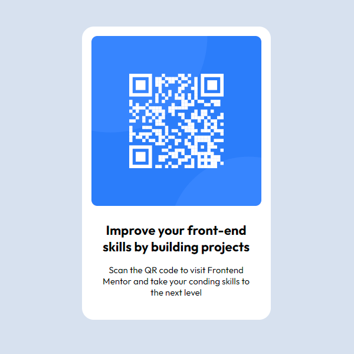

# Frontend Mentor - QR code component solution

## Table of contents

- [Overview](#overview)
  - [Screenshot](#screenshot)
  - [Links](#links)
- [My process](#my-process)
  - [Built with](#built-with)
  - [What I learned](#what-i-learned)
  - [Useful resources](#useful-resources)
- [Author](#author)
- [Acknowledgments](#acknowledgments)

## Overview

### Screenshot

### Links

- Solution: [GitHub repository](https://github.com/josip-h/frontendmentor-qr-code-component)
- Live Site: [GitHub pages](https://josip-h.github.io/qr-code-component/)

## My process

### Built with

- HTML5
- CSS
- GitHub Pages

### What I learned

By building this project I learned:

- Markdonw syntax and how to structure a README.md document for a small project
- How to publish a project using GitHub Pages

### Useful resources

- [Frontend Mentor](https://www.frontendmentor.io/) - Excellent resource for learning Front-end Development
- [GitHub Pages](https://pages.github.com/) - Simple step by step tutorial on how to host your repository on GitHub Pages
- [ChatGPT](https://chatgpt.com/) - Always a great way to find a solution to a problem

## Author

- Website - [Josip Hanzevacki](https://github.com/josip-h)
- Frontend Mentor - [@josip-h](https://www.frontendmentor.io/profile/josip-h)

## Acknowledgments

I would like to express my gratitude to Frontend Mentor for providing such valuable resource for learning front-end development. Their platform goes beyond teaching just the technical aspects; it shows the entire process of project development. From design implementation to best coding practices and real-world project experience.
